# tasindex

TASIndex (Thermal Analysis for Space Index) is a comprehensive database and information system for tracking spacecraft thermal analysis tools and methodologies. This project aims to catalog which software tools were used in the thermal analysis of various spacecraft missions, creating a structured repository of thermal engineering knowledge.

## Database Design

### Overview

TASIndex uses a relational database to catalog spacecraft thermal analysis information. The database is designed to track which software tools were used to analyze different spacecraft, along with relevant academic references.

### Entity Relationship Model

The database follows a structured entity-relationship model as visualized in the ER diagram. The core entities include:

- `Spacecraft`: Basic information about space vehicles including COSPAR ID, NSSDCA ID, name, and launch date
- `ThermalAnalysisObject`: Components or systems being analyzed (often the whole spacecraft), associated with a specific spacecraft
- `Software`: Thermal analysis tools used in the studies, with details on version and features
- `Reference`: Academic papers and documents referenced, stored with BibTeX metadata
- `ThermalAnalysisEntry`: The central entity connecting analysis objects with software and reference sets
- `SoftwareSet`: Collections of software tools used together in analysis
- `ReferenceSet`: Collections of references cited for a particular analysis



### Setup Procedure

The database is built using a Python script that processes a CSV file containing spacecraft thermal analysis information and a BibTeX file with reference information.

The `build_database.py` script handles the complete database setup process:

1. Creates a new SQLite database using the schema defined in `schema.sql`
2. Imports references from the BibTeX file (`references.bib`)
3. Processes spacecraft thermal analysis data from the CSV file (`tasindex_import.csv`)
4. Builds the necessary relationships between entities (software sets, reference sets)

```bash
# Navigate to the database directory
cd database

# Run the build script
python3 build_database.py

# Check the row counts to verify correct build
sqlite3 spacecraft_thermal.db "SELECT 'Spacecraft', count(*) FROM Spacecraft UNION ALL SELECT 'Software', count(*) FROM Software UNION ALL SELECT 'ThermalAnalysisEntry', count(*) FROM ThermalAnalysisEntry;"
```

## Frontend Design
